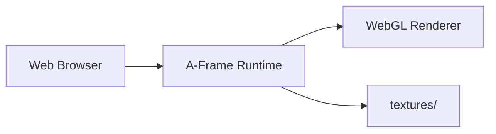

# A-Frame VR Scene

**Computer Graphics project** — interactive 3D dining-room environment built with A-Frame and WebGL, featuring textured furniture, animated objects, and first-person camera navigation.

---

## Table of Contents

- [System Design](#system-design)
- [Features](#features)
- [Technology Stack](#technology-stack)
- [Getting Started](#getting-started)
- [Project Structure](#project-structure)
- [Deployment](#deployment)
- [License](#license)

---

## System Design

A static **single-page WebVR scene** with no backend or build pipeline. The browser loads A-Frame from a local bundle and renders entities defined declaratively in HTML.



| Layer | Role |
|-------|------|
| **index.html** | Scene graph — entities, materials, animations, camera |
| **script/aframe.js** | Bundled A-Frame library |
| **textures/** | Image assets for sky, floor, furniture, and props |

> **Note:** No `package.json` or npm build step — serve the folder as static files.

---

## Features

- 360° sky background and checkerboard floor
- Textured dining table, four chairs, and tabletop items
- Animated rotating box
- First-person camera with gaze cursor
- Car-park circle with theatre texture
- Cylindrical entrance frame

---

## Technology Stack

| Component | Technology |
|-----------|------------|
| VR framework | A-Frame (bundled) |
| Rendering | WebGL / WebVR |
| Markup | HTML5 |
| Assets | PNG/JPG textures |

---

## Getting Started

### Prerequisites

- A modern browser with WebGL support (Chrome, Firefox, Edge)

### Run locally

```bash
# Option A — open directly
start index.html

# Option B — static server (recommended for texture loading)
npx serve .
# or
python -m http.server 8080
```

Then open `http://localhost:8080` (or the port shown).

---

## Project Structure

```
A-Frame/
├── index.html          # Scene definition (main entry)
├── script/aframe.js    # A-Frame library bundle
├── textures/           # Image assets
└── README.md
```

---

## Deployment

Deploy to any static host:

- **GitHub Pages** — push repo and enable Pages on `main`
- **Netlify / Vercel** — drag-and-drop or connect repo; no build command needed

No environment variables or server configuration required.

---

## License

Academic project — see repository owner for usage terms.
